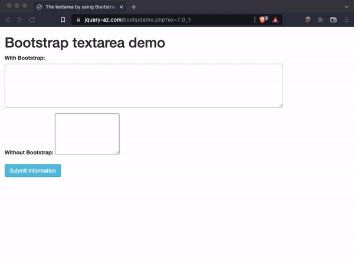

<h2 align="center">
Le brutte intenzioni...
</h2>
<div align="center">


</div>

#

<div align="center">


</div>

L'estensione browser per il web developer che rimpiange il vero problema dell'Italia all'inizio del 2020: [Bugo che abbandona Morgan a al festival di Sanremo](https://www.youtube.com/watch?v=P6T3xM4_u6)

L'estensione permette di generare al volo e copiare nella clipboard e nell'ultimo campo di testo selezionato, il testo della canzone Sincero di Bugo e Morgan nella variante che ha scritto la storia. Basta con i Lorem Ipsum, è ora di utilizzare qualcosa di più provocatorio e divertente per i vostri prototipi del 2020.

## Demo 📺



## Contribuire 🧑‍🤝‍🧑

Sviluppato con `node v15.2.0` `npm v8.4.0`

Installa le dipendenze

```sh
npm install
```

per creare la build di produzione

```sh
npm run build:chrome #build per chrome
npm run build:firefox #build per firefox
npm run build:all #build per chrome e firefox
```

avviare in watch mode con hot-reload:

```sh
npm start
```
